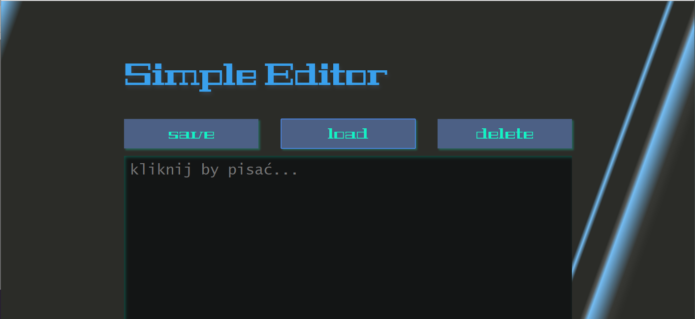

# Simple Editor

## editor resistant to refreshing

### how it works
The edit area wont be clean even you refresh a page. Text is stored on Session Storage.

When you press **save** text from the edit area will be saved on Local Storage.

Pressing **load** will display text stored in Local Storage if you saved it.

Pressing **delete** will delete stored text in Session and Local Storage, clear the text area as well. 

[***Kliknij by przejść do tej strony***](https://mankom.github.io/simple-editor/)
